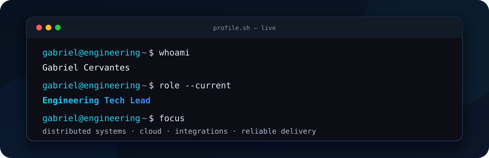

<picture>
  <source media="(prefers-color-scheme: dark)" srcset="assets/banner-dark.svg">
  <source media="(prefers-color-scheme: light)" srcset="assets/banner-light.svg">
  
</picture>

 

 

---

## This is me

Hi, I'm **Gabriel Cervantes**, a software engineer and Engineering Tech Lead based in Mexico.

I design and lead platforms that connect procurement, logistics, documents, ERPs, and real-world operations. I enjoy turning complex business processes into systems that are observable, resilient, and easier for teams to evolve.

- 🧭 **Engineering Tech Lead at Birdie**, working across architecture, delivery, and technical leadership.
- 📦 Building products for **procurement, order tracking, logistics, and document intelligence**.
- ⚡ Designing **event-driven services** and asynchronous workflows with Kafka.
- ☁️ Running containerized workloads on **AWS**, with infrastructure defined as code.
- 🔌 Integrating enterprise systems through APIs, databases, SFTP, and private networks.
- 🤝 Helping engineering teams make pragmatic technical decisions and ship safely.
- 🎓 Electronics Engineer with a master's degree in Information and Communication Technologies.

> Most of my professional contributions live in private repositories. The public projects below represent earlier work and technical explorations; my current focus is large-scale platform architecture and engineering leadership.

## What I build

| Area | What it means in practice |
| --- | --- |
| **Distributed platforms** | Service boundaries, asynchronous processing, event contracts, retries, idempotency, and observability. |
| **Enterprise integrations** | ERP synchronization, document workflows, SFTP, database connectors, and secure network paths. |
| **Cloud infrastructure** | AWS ECS/Fargate, MSK, S3, Redis, CloudWatch, VPC, VPN, KMS, and infrastructure as code. |
| **Product engineering** | Backend APIs, frontend platforms, technical discovery, delivery planning, and team enablement. |

## My working stack

 

`Pulumi` · `Amazon ECS` · `Amazon MSK` · `S3` · `CloudWatch` · `REST APIs` · `SSE` · `CI/CD`

---

## Experience snapshot

### Engineering Tech Lead · Birdie

Leading technical direction for logistics and procurement products, including order synchronization, document processing, validation workflows, real-time notifications, and enterprise integrations.

### Engineering Lead · Kavak

Led software engineering initiatives in a high-growth technology environment. The work was developed in private company repositories and is therefore described here without exposing proprietary implementation details.

### Earlier work

Software development, technology consulting, IT leadership, and academic systems across web platforms, APIs, databases, and operational tooling.

---

## Selected public work

<table>
<tr>
<td width="33%" valign="top">

### [restApiBonds](https://github.com/brakeencj/restApiBonds)

Financial REST API with Django REST Framework, authentication, data modeling, currency calculations, and Swagger/Redoc documentation.

`Python` `Django` `DRF`

</td>
<td width="33%" valign="top">

### [angularPwaSwBelvo](https://github.com/brakeencj/angularPwaSwBelvo)

Angular progressive web application integrating Belvo, with routing, service workers, reusable components, and responsive UI.

`Angular` `TypeScript` `PWA`

</td>
<td width="33%" valign="top">

### [oesteBackEnd](https://github.com/brakeencj/oesteBackEnd)

REST API for related person and identification entities, including CRUD operations, logical deletion, persistence, and API documentation.

`Java` `Spring Boot` `JPA`

</td>
</tr>
</table>

---

### Let's build systems that survive the real world.

`architecture · integrations · reliability · leadership`

